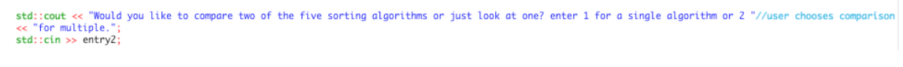
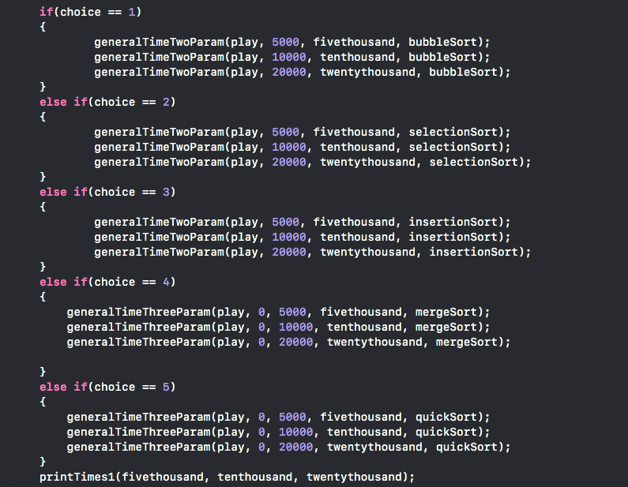
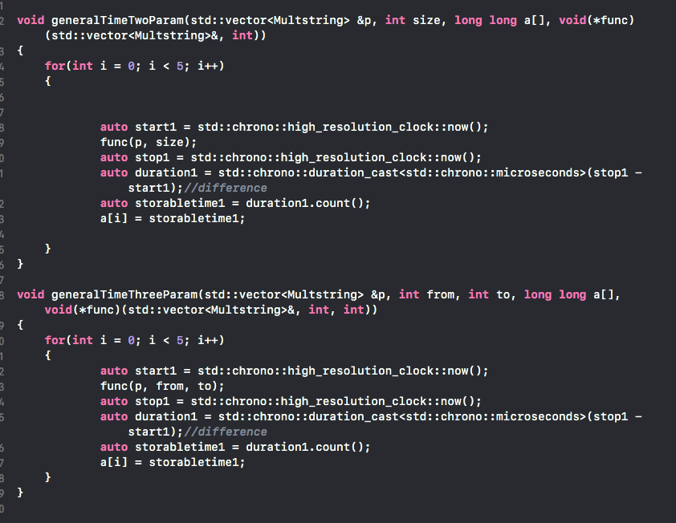
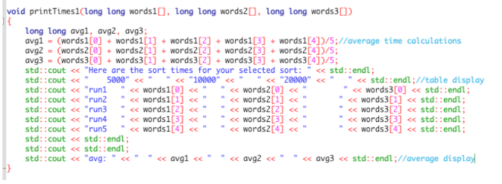
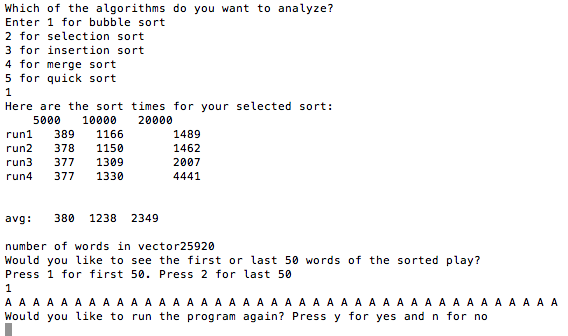
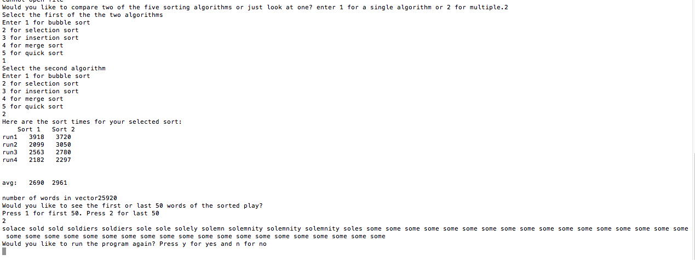

# sorting-times
Testing several sorting algorithms by sorting several Shakespeare plays of varying lengths.

<ins>Purpose</ins>

The purpose of this lab is to compare the various sorting algorithms that we have learned so far. We would first read in the shakespeare .txt files and then sort them according to the guidelines. The program is user friendly and should provide a variety of different options

<ins>Planning and Organization</ins>

To read the files in, I first declared a variable called infile of type std::ifstream. I then included an if else statement to stream in a file based on the user’s preference. Each branch of the if-else statement streams in and stores each .txt input as a std::string variable declared as text. There is also an if statement to check if the file was successfully streamed in. To store the streamed in text, I decided to create a structure called Multstring. In this structure, I have two std::string variables. One of them, punc, will be used to store the initial text streamed in unedited. The second std::string, nopunc, will take in the same text that was streamed in after it has been modified to remove punctuation to make sorting easier. To store all of the std::string words, I declared a vector of the user defined type Multstring. 

To fill the vector, I decided to use a while loop with the condition !infile.eof() which will execute the code inside the while loop until all the text is streamed in. The initial text is placed in the punc member of the Multstring object called play which was declared at the top of the main() function. 

To filter out the punctuations, I decided to use a while loop and the ispunct() function to scan the string for any sort of punctuation. The new formatted std::string was then placed in the nopunc member of the struct variable. After the Multstring variables were initialized I made my Multstring vector play increase in size using the push_back() function. At the end of the while loop, I made sure to increment an int variable named count which will be used as a parameter for my future functions and as a debugging variable.
Image placeholder?

After the Multstring vector is fully initialized, we progress to the next user prompt below:

||
|:--:|
|User Prompt|

Based on the user’s choice on this prompt, we either compare one sort over a variety of data values or compare two sorts over the whole .txt file.

I’ll start by explaining my reasoning on the singular sort comparison. After a user chooses which sort that they would like to use, we pass the sorting function along with the appropriate parameters to one of our time functions either generalTimeTwoParam or generalTime3Param. These functions will be explained shortly.

||
|:--:|
|Single Sort Implementation|

As mentioned above, we pass the sorting algorithm along with the appropriate parameters into our timing functions pictured below. The generalTimeTwoParam function handles bubble sort, selection sort and insertion sort. The generalTimeThreeParam function takes care of merge sort and quicksort.

||
|:--:|
|Time Functions|

The display function pictured below for the singular sort comparison takes three int arrays as arguments. Each of these arrays stores the times of the five calls to the specific sort function. So in total, we would display fifteen sorting times when we call our printTimes1 function. The average for each differing element run is calculated by taking all of the members of the appropriate array and dividing by five. I used blank spaces to space out the times in their appropriate column.

||
|:--:|
|Display Function|

Now it’s time to account for the program if the user decides to select the option to compare multiple sorts. The implementation is very similar to the singular sorter option, all we really change in regards is the parameters that are passed to the sort functions. We replaced the 5000, 10000 and 20000 numbered values with the variable count. Since count was incremented every time a word was streamed in via infile, count represents the whole .txt file of the selected play. 

<ins>Product</ins>

After testing the functions, they all worked as expected with reasonable sorting times for each sorting algorithm. An example is bubble sort below.

||
|:--:|
|Bubble Sort|

Below is my implementation of the comparison of two sorts. As expected the average time of bubble sort was lower than the average time of selection sort. The output seems accurate.

||
|:--:|
|Bubble Sort and Selection Sort comparison|

